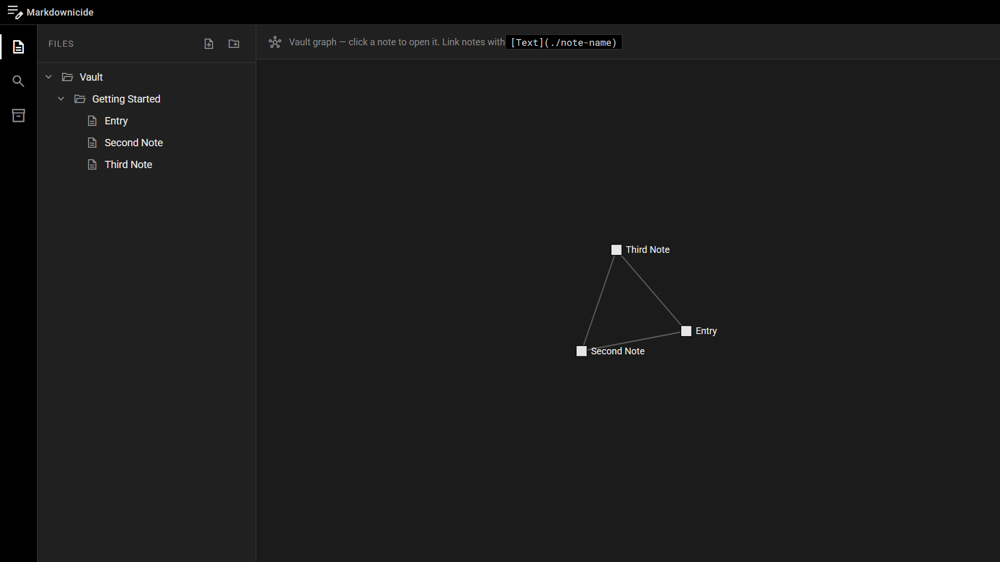

# Markdownicide

Markdownicide is a distraction-free, VS Code-like, Obsidian-inspired Markdown editor for the web. Made fully persistent via IndexedDB (with cloud backup as an anticipated feature), you can write notes and have them persist through a reload.

## Overview

Markdownicide is VS Code if it had a baby with Obsidian. It has wiki-like linking (`[Page](./page)`) to other notes, even if they're in different folders.
